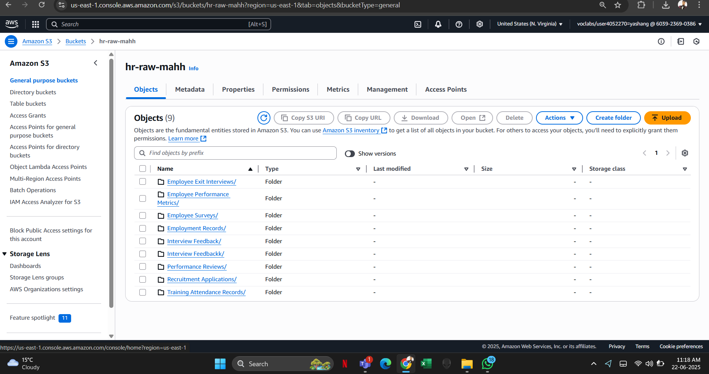

# Data-analyst-yashang

## Descriptive Analysis

*Project Description*  
Descriptive Analysis of Year-over-Year Trends in Average Fee Paid and Employee Count by City (2024–2025)

*Project Title*  
Understanding Average Fee Paid and Employee Count by City in Vancouver, Animal Services.

*Objective*  
The objective of this visualization is to perform a descriptive analysis of business license data using AWS Data Analytics Platform (DAP).  
By plotting the average fee paid and the average number of employees per city from 2024 to 2025, the dashboard aims to reveal temporal and regional trends that can assist city planners and business analysts in understanding fee structures and workforce distribution across municipalities.

*Dataset*  
This dataset includes business licence records from 2024 onwards with Animal Services.  
The data was uploaded to an AWS S3 bucket as the raw input for the pipeline.

## Methodology

### 1. Data Collection and Preparation

- *Load the dataset using data analysis tools:* Secure Storage Setup (S3 Bucket) used
- ## Folder Structure in S3
- Set up **nine categorized folders** for structured HR datasets

## S3 Bucket Configuration
- Created **S3 bucket**: `hr-raw-mahh`
- Hosted in **US East (N. Virginia)** region

- ## EC2 Instance Setup
- Launched EC2 instance: **HRVS-MAH**
- Attached a **30 GiB EBS** volume

## Security Configuration
- Configured **security group** for instance access and data flow

## Documentation Contribution
- Contributed to **data lake architecture and analysis documentation**
- Documentation covers:
  - Tagging strategy  
  - Storage class policies  
  - Mapping of business questions (e.g., sentiment-performance correlation)
- *Performed data cleaning to address missing values, correct data types, and remove duplicates:* AWS Glue DataBrew service used.
